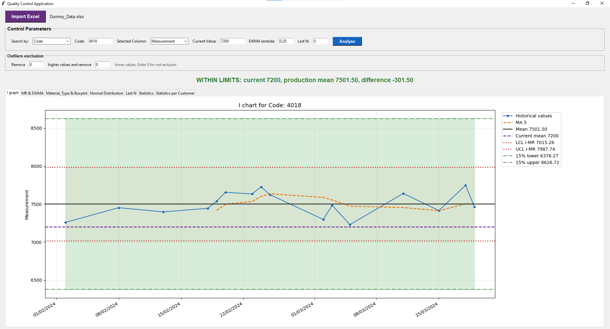
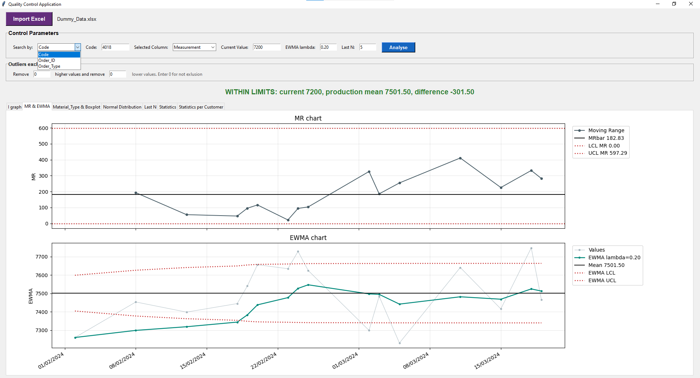
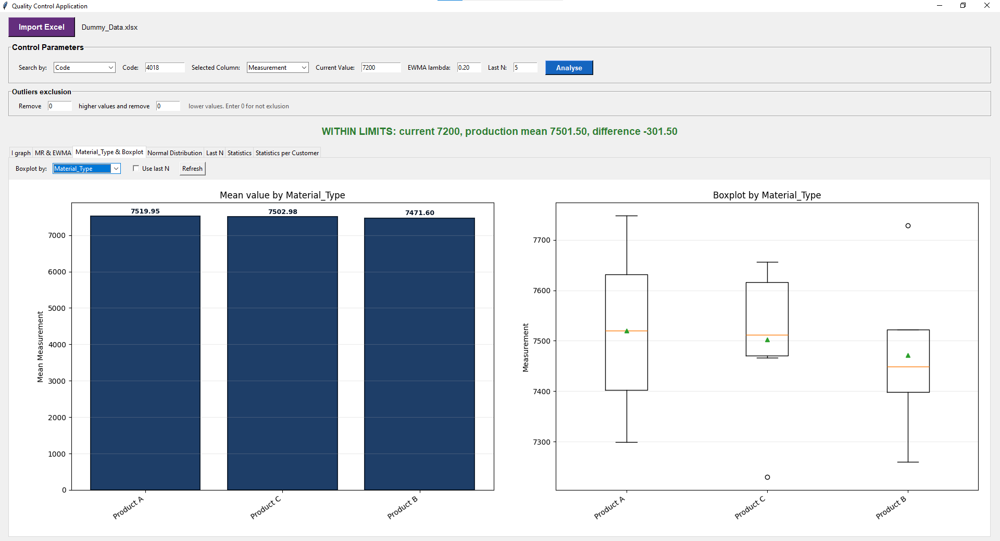
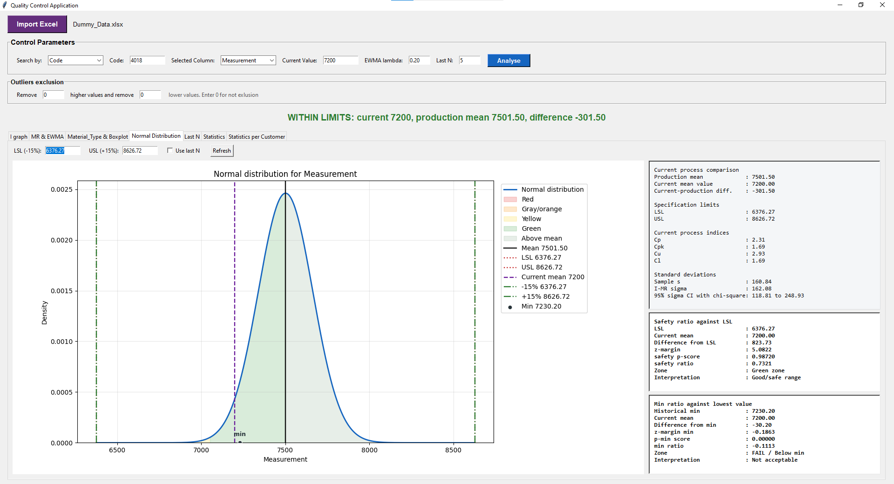

# SPC Quality Control Application

A desktop Python application for Statistical Process Control (SPC) and quality analysis.

This project was created to support quality-control work by analyzing historical production data, comparing current measurements with past performance, and visualizing process behavior through SPC charts and statistical summaries.

## Features

* I-MR Control Charts
* Moving Range Monitoring
* EWMA Monitoring
* Process Capability Analysis (Cp, Cpk)
* Customer-Based Statistics
* Historical Trend Analysis
* Outlier Exclusion
* Material-Type Analysis
* Boxplot Visualization
* Excel Import Support

## Technologies

* Python
* Pandas
* NumPy
* SciPy
* Matplotlib
* Tkinter

## How to Run

Install the required libraries:

```bash
pip install -r requirements.txt
```

Run the application:

```bash
python spc_quality_control.py
```

## Excel Input

The application works with Excel files containing production or quality-control measurements.

It can analyze data based on fields such as:

* Code
* Order ID
* Order Type
* Measurement
* Customer
* Material Type
* Process Date

The exact column names can be adjusted inside the application logic if needed.

## Specification Limits

By default, the application automatically creates provisional specification limits:

* LSL = Mean × 0.85
* USL = Mean × 1.15

These default limits are only used as configurable demonstration values.

They do not represent any official standard, ISO requirement, customer specification, or regulatory limit.

Users can manually adjust LSL and USL according to the actual product specifications and quality requirements.

## Screenshots

### I Chart



### MR & EWMA Monitoring



### Material Analysis



### Process Capability Analysis



## Development Note

This project was developed with the assistance of AI coding tools for code generation, debugging, and refactoring.

The SPC methodology, quality-control requirements, calculations, business logic, and application structure were defined, reviewed, and tested by the author.

## Future Improvements

* Nelson Rules
* Western Electric Rules
* Xbar-R Charts
* p / np / c / u Charts
* PDF Report Export
* Database Integration
* Power BI Connectivity

## Disclaimer

This application is intended as an educational and engineering-support tool.

Quality decisions should always be verified against official product specifications, customer requirements, internal quality procedures, and engineering judgment.


